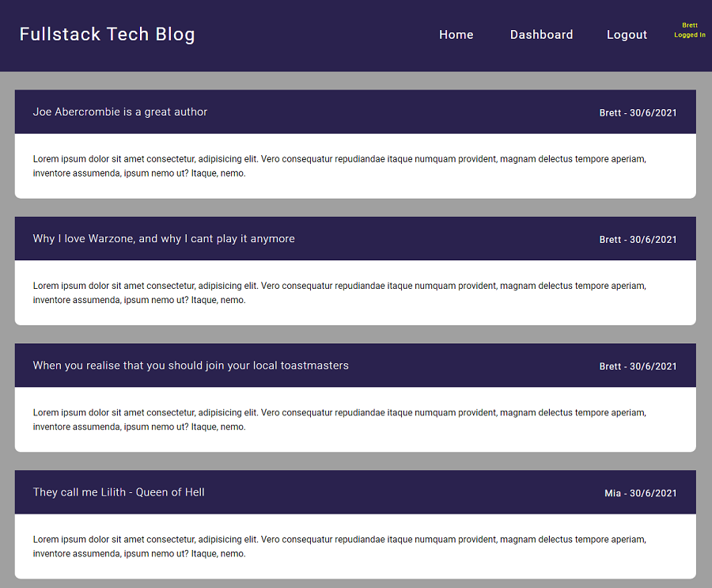

# Fullstack Tech Blog  
  


[Here is a link to the deployed App on Heroku](https://fullstack-tech-blog.herokuapp.com/)

[Here is a link to the gitHub repo](https://github.com/brett-treweek/Fullstack_Tech_Blog)  


## Description
This Web Application is a CMS-style blog site that has been built from the ground up using HTML, CSS, JavaScript and NodeJs. It has an Express server, a MySql Database, uses Sequelize as the ORM and Handlebars as the templating engine. Model View Controller has been used for its architectural structure, and authentication is implemented through express-session.

Users can view all posts and associated comments on the homepage, but must log-in or sign-up in order to post comments on other users' posts. When logged-In, a user can also view their dashboard, where they can edit or delete their blog posts and create new ones.

If a user is inactive on the application for more than five minutes they will be logged out and can only view posts on the homepage. They are prompted to log-in again if they would like to use any other functionality.

---
## Table of Contents

- [Installation](#installation)
- [Usage](#usage)
- [License](#license)
- [Contributing](#contributing)
- [Tests](#tests)
- [Technologies](#technologies)
- [Future Development](#future-development)
- [Questions](#questions)

---
## Installation  
  
Please follow these steps to install the project and any dependancies locally.

```bash
install node.js
clone the repo from gitHub
npm install
create MySQL schema from db file
add .env file
npm run seed
```

---
## Usage
The best way to try the app is on heroku.
You can create a new account or use these credentials to log in.  
```
Username: Mia
Password: Mia123
```  

[Follow this link to easily use the app on Heroku.](https://fullstack-tech-blog.herokuapp.com/)

Run the app locally with the following command.   

```bash
npm start
```
Then open your browser and navigate to:
```bash
http://localhost:3001
```


---
## License

This project is licensed under 

---
## Contributing

Contributing to this project is not currently available.

---
## Tests

Please use these commands to perform tests.

```js

There are no tests at present.

```

---

## Technologies

- HTML
- CSS
- Javascript
- Node.js
- MySQL
- Sequelize
- Handlebars
- Express-Session
- MVC
- DotEnv
- Heroku
---
## Future Development
- Responsive Design
- Modern Accessability Implementation
- Password hashing


---

## Questions

For any questions and support please contact Brett Treweek  
- Email: bretttrew@gmail.com  
- Github: [brett-treweek](https://github.com/brett-treweek)